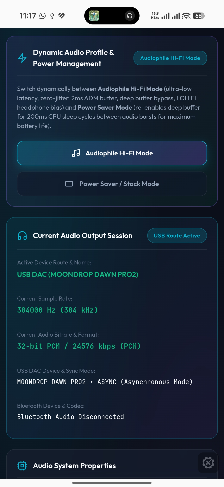
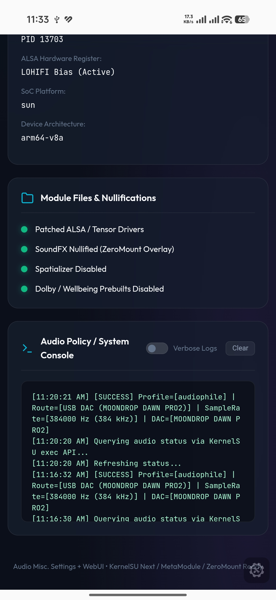

# Audio Misc. Settings + WebUI 🎧

A high-performance **Universal (Magisk / KernelSU / KernelSU Next / APatch)** audio engine engineered for audiophiles to unlock mastering-quality audio, reduce clock jitter, bypass Android system sound limiters, tune hardware ALSA gain registers, dynamically toggle between **Audiophile Mode** and **Power Saver Mode**, switch Sample Rates (up to 768kHz) & Bit Depths on-the-fly, and control the engine via an interactive WebUI, Magisk Action Button, or Terminal CLI.

---

**Disclaimer**: This module is mostly generated by Antigravity Gemini (Vibecode) for my needs. Use it at your own risk. Tested normally on my device (Poco F8 PRO)

## 🌟 Key Features & Audiophile Optimizations

1. **Universal Root Solution Compatibility**:
   - **KernelSU / KernelSU Next / APatch**: Native WebUI tab, action button, and services.
   - **Magisk (v24+ / v26+ / v27+)**: Direct installation, **Magisk Action Button** support, **KsuWebUIStandalone** WebUI, and **MMRL** WebUI.

2. **On-The-Fly Manual Sample Rate & Bit Depth Switcher (44.1 kHz up to 768 kHz / 32-bit)**:
   - Manually select and force the target sample rate (**44.1k, 48k, 88.2k, 96k, 176.4k, 192k, 352.8k, 384k, 705.6k, 768k**) and bit depth (**16-bit, 24-bit, 32-bit PCM, 32-bit Float**) on the fly without rebooting.
   - Generates and bind-mounts dynamic audio policy topology overlays and reloads `audioserver` seamlessly.

3. **USB DAC Hardware Capability Detection (`/proc/asound/card*/stream0`)**:
   - Directly parses ALSA USB Audio Class endpoint descriptors to identify the connected DAC hardware's exact supported sample rates and bit depths.
   - Highlights supported hardware rates dynamically in the WebUI.

4. **96kHz Limit Unlocker (Universal Legacy & Modern SoC Support)**:
   - Systemlessly unlocks `/vendor/lib/libalsautils.so` and `/vendor/etc/audio_platform_configuration.xml` to eliminate Android's default 96kHz USB HAL driver cap (unlocking up to **768 kHz 32-bit**).
   - Resolves 96kHz lock feedback on older devices like Xiaomi Mi 6X (Snapdragon 660 / `sdm660`), Galaxy devices, and legacy platforms.

5. **Audio Policy Architecture Engine**:
   - Complete bundled templates for modern Android 7.0 HAL and legacy pre-7.0 HALs:
     - **Bypass Offload Safer (Recommended)**: Bypasses USB & Bluetooth DSP hardware offload (using low-jitter AOSP drivers) while keeping internal speaker at safe 48kHz.
     - **Bypass Offload (Pure)**: Uncompromised direct lossless routing on all endpoints.
     - **Direct PCM Offload**: Bypasses system audio mixers with direct PCM & compressed offload modes.
     - **Hardware Offload**: Qualcomm / Vendor DSP hardware tunneling with custom rate locks.
     - **HiFi Playback Offload**: Enables USB HiFi Playback mixer routing.
     - **Legacy / Safe Mode**: Safe fallback for older devices (Mi 6X, SDM660, legacy A2DP HAL).
     - **USB Policy Only**: Overlays USB audio policy directly.

6. **Dynamic Range Control (DRC) & USB Transfer Jitter Tuning**:
   - Toggle DRC on/off on the fly (Lossless Pure Dynamics vs Stock Limiter Compression).
   - Adjustable USB transfer packet interval presets (2000 µs, 2250 µs, 3875 µs, 4000 µs, 5000 µs) for precision clock phase alignment.

7. **Dynamic Audio Profile Manager (Audiophile Mode vs. Power Saver Mode)**:
   - **Audiophile Hi-Fi Mode (Maximum Fidelity)**:
     - **Deep Buffer Bypass (`audio.deep_buffer.media=false`)**: Deactivates standard ~200ms power-saving deep buffers to force direct PCM routing, eliminating unwanted software Sample Rate Conversion (SRC) inside AudioFlinger.
     - **Low-Jitter ADM Buffer (`vendor.audio.adm.buffering.ms=6`)**: Restricts Qualcomm Audio Dispersion Manager delay bounds to 6ms, lowering CPU scheduling clock jitter.
     - **Qualcomm HiFi Hardware Pipeline (`persist.vendor.audio.hifi=true` & `persist.vendor.audio.hifi.int_codec=true`)**: Unlocks dedicated low-noise, high-bias operating parameters on Qualcomm SoC platforms and bypasses standard codec pipelines for direct high-bit-depth PCM routing.
     - **Low-Distortion Headphone Bias (`RX_HPH_PWR_MODE LOHIFI`)**: Elevates bias currents to internal headphone amplifier stages, lowering Total Harmonic Distortion (THD) under low-impedance headphone loads.
     - **Transient Envelope Integrity (`WSA_COMP1/2 Switch 0`)**: Disables hardware-level speaker dynamic range compression to prevent tracking clipping and maintain full dynamic punch.
   - **Power Saver Mode (Battery Preservation)**:
     - **Extended ADM Buffer (`vendor.audio.adm.buffering.ms=12`)**: Allows the application processor (CPU) to sleep in longer intervals between audio buffer transfers, reducing CPU wakeups and power draw.
     - **Lightweight Polyphase Sinc Filter (`ro.audio.resampler.psd.halflength=160`)**: Reduces resampler math by over 60% without frequency smearing or distortion.
     - **Rapid DAC Standby Sleep (`ro.audio.flinger_standbytime_ms=50`)**: Powers down audio clocks and DAC rails 4x faster when music is paused.
     - **Ultra-Low Power Bias (`RX_HPH_PWR_MODE ULP`)**: Reverts headphone amplifier stages to Ultra-Low Power mode to save battery.
   - **Reboot-Persistent State**: Profile selection is automatically saved in `mode.conf` and `samplerate.conf` and retained across system reboots.

8. **Low-Level ALSA Hardware Register Calibration (`tinymix`)**:
   - **USB-C DAC 100% Gain Override Fix**: Overrides non-standard USB class limits (`tinymix "DAC Volume" 100%` and `tinymix "Headphone Playback Volume" 100%`), ensuring external DACs operate at their true physical electrical gain without software dynamic range compression or half-volume issues.
   - **Reference Analog Gain (`ADC1 Volume 6`)**: Calibrates input gain registers for reference-level analog capture.

9. **100 Volume Steps Control**:
   - Expands media volume steps from 15 to **100 steps** (~0.4–0.7 dB per step) for precise volume tuning on sensitive IEMs, headphones, and external speakers.

10. **Safe Pure-Audio Direct Pass (HyperOS & Flagship SoC Compatible)**:
    - Disables OEM sound interception policies (`vendor.audio.effect_policy.support=false`, `ro.vendor.audio.fweffect=false`) and compression limiters to achieve a clean, unaltered direct audio path without risking `audioserver` crashes.

11. **Safety & Volume Dose Limiters Disabled**:
    - Bypasses Android safe volume warnings (`audio.safemedia.bypass=true`) and disables European sound dose limiters.

---

## 📱 How to Access the WebUI & Control Methods

### Option A: Built-in KernelSU / APatch WebUI Tab
If you are using **KernelSU**, **KernelSU Next**, or **APatch**, open the manager app and tap the **WebUI** button on the module card.

### Option B: Standalone WebUI on Magisk via KsuWebUIStandalone (Recommended)
1. Download & install the lightweight **[KsuWebUIStandalone APK](https://github.com/MeowDump/KsuWebUIStandalone)**.
2. Grant Root permission when requested.
3. Open the app and tap **Audio Misc. Settings** to launch the full real-time WebUI control panel.

### Option C: Magisk Action Button (No Extra App Required!)
If you are on **Magisk v26+**:
1. Open **Magisk App** -> **Modules**.
2. Tap the **Action** button next to **Audio Misc. Settings**.
3. View live audio diagnostics and interactively configure sample rates, profiles, ALSA tinymix, and more directly in Magisk.

### Option D: Terminal CLI (`audiomisc`)
Use your favorite terminal emulator (Termux, ADB Shell, etc.):
```sh
# Launch interactive terminal UI
su -c audiomisc

# Or run one-shot CLI commands
su -c audiomisc status               # Show audio pipeline diagnostics
su -c audiomisc rate 192000          # Switch sample rate to 192 kHz
su -c audiomisc depth 32             # Switch to 32-bit float
su -c audiomisc mode audiophile      # Switch to Audiophile Hi-Fi profile
su -c audiomisc drc false            # Disable DRC
su -c audiomisc tinymix              # Calibrate ALSA DAC volume to 100%
su -c audiomisc restart              # Restart audioserver
su -c audiomisc reset                # Reset all overrides to default
```

---

## 🛡️ Stealth & Anti-Detection (ZeroMount / Banking Apps)

- **Zero Mount Pollution**: Native OverlayFS nullification and configuration patching without `/proc/mountinfo` pollution.
- **Banking App Compatible**: Leaves **zero extra mount entries** in `/proc/self/mountinfo`.
- **No Extra Modules Required**: Fully standalone—**no need to install `compatible-magisk-mirroring`**.

---

## 💡 Audiophile Best Practices Guide

- **Bit-Perfect Playback**: For the highest fidelity, use player apps like **USB Audio Player PRO (UAPP)**, **HiBy Music**, or **Poweramp** with Direct Hi-Res output enabled.
- **Profile Management**: Use **Audiophile Mode** when listening to high-resolution music or sitting down with external DACs/headphones, and switch to **Power Saver Mode** during long workdays when audio is not actively playing to conserve battery life.
- **Battery Optimization**: Change battery usage settings for your music player apps to **Unrestricted** (or "Don't optimize") to eliminate micro-stuttering caused by Android CPU scaling.
- **Disable Digital Wellbeing**: Uninstall or restrict the "Digital Wellbeing" system app to prevent background CPU interrupts during audio playback.

---

## 📸 Screenshots

<p align="center">
  <a href="assets/status.jpg">
    
  </a>
  <a href="assets/log.jpg">
    
  </a>
</p>
<p align="center">
  <sub><i>Tap or click any screenshot to view in full resolution</i></sub>
</p>

---

## 🔧 Installation & Safe Mode Recovery

1. **Installation**:
   - Flash `audio-misc-settings-ksu-webui.zip` in **Magisk App**, **KernelSU Manager**, **KernelSU Next**, or **APatch**.
   - Reboot your device.

2. **Bootloop Safe Mode**:
   - If a conflict occurs with another audio mod, hold **Volume Down** during boot to trigger Safe Mode, or remove `/data/adb/modules/audio-misc-settings-ksu-webui` via TWRP/recovery.

---

## 🙏 Credits & Acknowledgments

- **Original Author**: Special thanks to **[zyhk / yzyhk904](https://github.com/yzyhk904)** for creating the original [Audio Misc. Settings](https://github.com/yzyhk904/Audio-Misc-Settings) Magisk module, foundational AudioFlinger resampler tuning, and hardware period buffer optimizations.
- **KernelSU & WebUI Integration**: Enhanced, modernized, and expanded by **[Chthome Luii / IniGisah](https://github.com/IniGisah)** with KernelSU WebUI integration, dynamic audio profile switching, ALSA hardware controls, and banking app compatibility.

---

## 📄 License & Disclaimer

Provided as-is for audiophiles and music lovers. Flash at your own choice.
